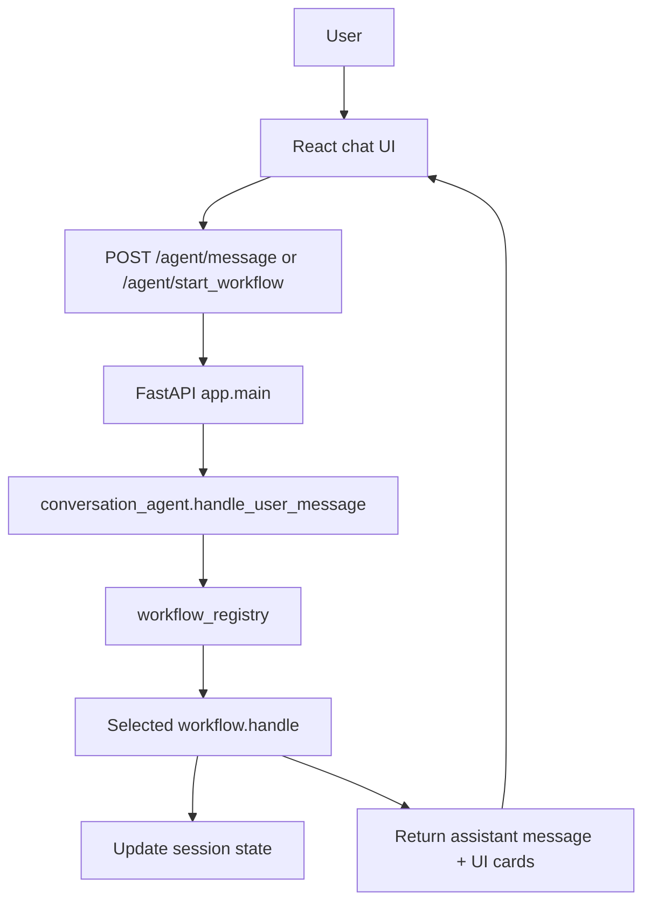
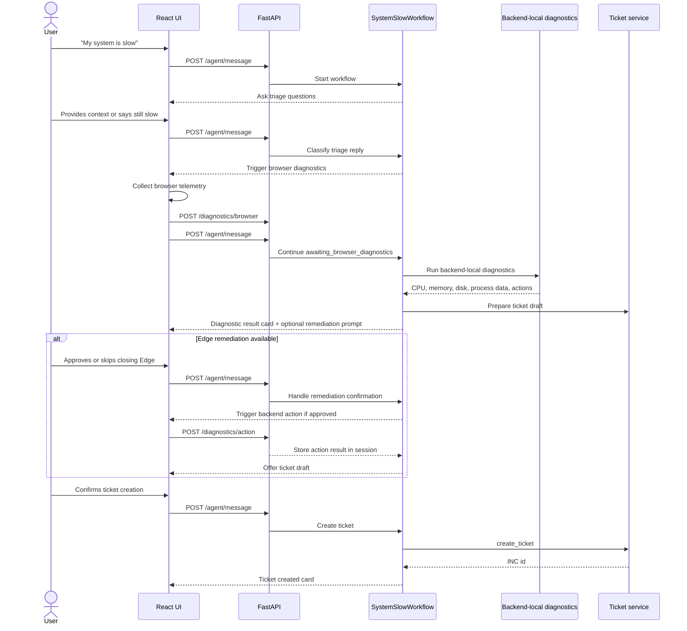
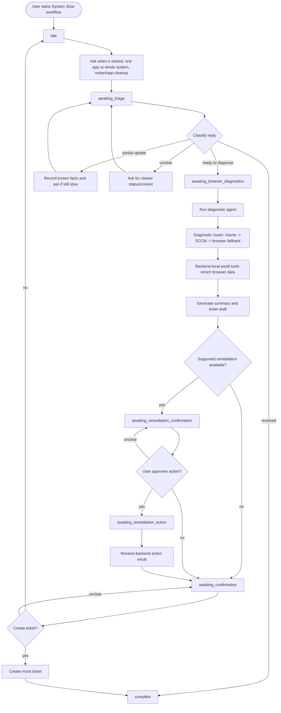
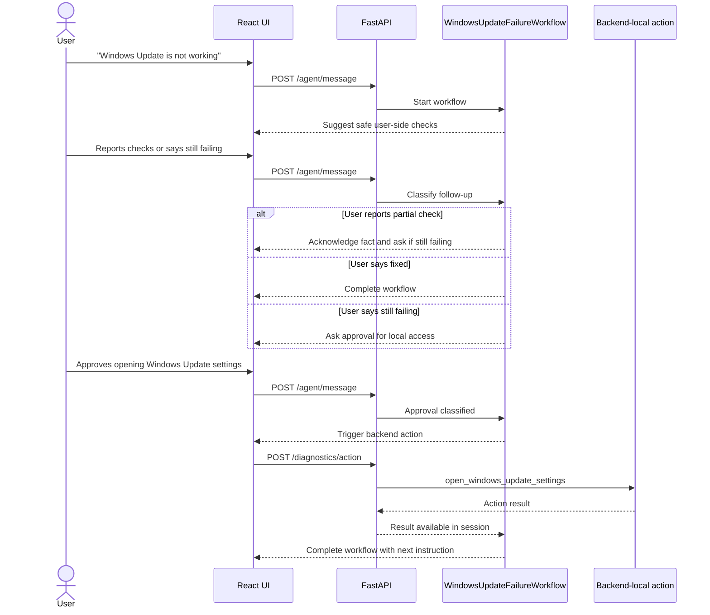
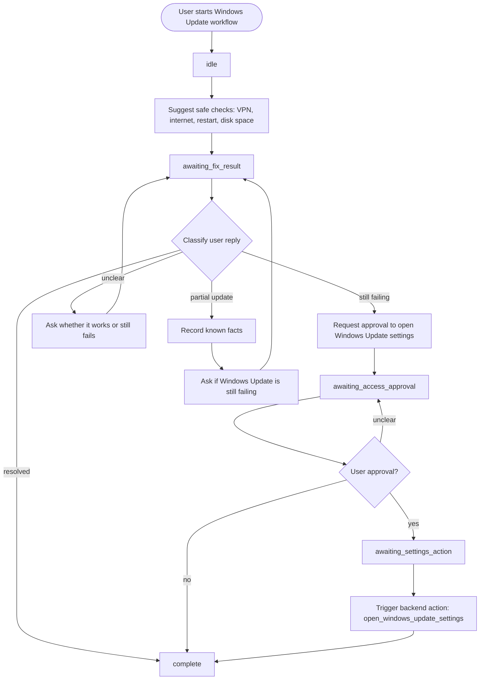
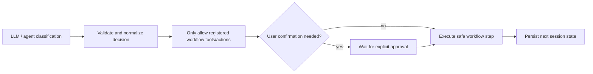

# Workflow Flowcharts

This document shows the runtime flow for key helpdesk workflows. The diagrams use Mermaid syntax, which renders in GitHub and many Markdown viewers.

## Shared Request Flow

All workflows run inside the same FastAPI backend process. A frontend chat turn calls the backend, the conversation agent chooses or continues a workflow, and the selected workflow updates the session state.

Important points:

- The backend is one running FastAPI app, not a separate Python script launched for every step.
- Each chat turn is one HTTP request.
- Multi-step workflows continue by storing state in the session store.
- LLM calls are optional; deterministic fallbacks keep the workflow usable without `OPENAI_API_KEY`.

## System Slow Diagnostics

Workflow id: `system_slow_diagnostics`

Primary files:

- `backend/app/workflows/system_slow/workflow.py`
- `backend/app/workflows/system_slow/agent.py`
- `backend/app/services/diagnostic_router.py`
- `backend/app/services/local_diagnostic_tools.py`
- `backend/app/services/ticket_service.py`
- `frontend/src/utils/browserDiagnostics.js`
- `frontend/src/components/DiagnosticResultCard.jsx`

### User-Level Flow

### State Flow

### What the Workflow Uses

- Triage classification uses a workflow turn agent or deterministic fallback.
- Diagnostics are selected in priority order: Intune, SCCM, then browser fallback with backend-local enrichment.
- Backend-local tools collect workstation telemetry through Python instead of a separate local app.
- Ticket drafts can be LLM-generated, with deterministic fallback text.
- Ticket creation happens only after explicit user confirmation.

## Windows Update Not Working

Workflow id: `windows_update_failure`

Primary files:

- `backend/app/workflows/windows_update_failure/workflow.py`
- `backend/app/services/local_diagnostic_tools.py`
- `frontend/src/pages/ConversationPage.jsx`
- `frontend/src/api/diagnosticApi.js`

### User-Level Flow

### State Flow

### What the Workflow Uses

- The workflow first recommends safe user-side checks before requesting access.
- Follow-up replies are classified by a workflow turn agent, LLM structured output, or deterministic fallback.
- Local access is gated by explicit user approval.
- The backend action only opens Windows Update settings; it does not run arbitrary commands.
- The workflow completes after the settings action is triggered or if the user says the issue is fixed/declines access.

## Safety Gates Across These Workflows

Key guardrails:

- LLMs classify or summarize; they do not directly execute shell commands.
- Workflow actions are allowlisted.
- Remediation and ticket creation require explicit confirmation.
- Session state controls what kind of reply is accepted at each step.
- Backend-local diagnostics/actions are centralized in the backend for easier auditing and future hardening.
